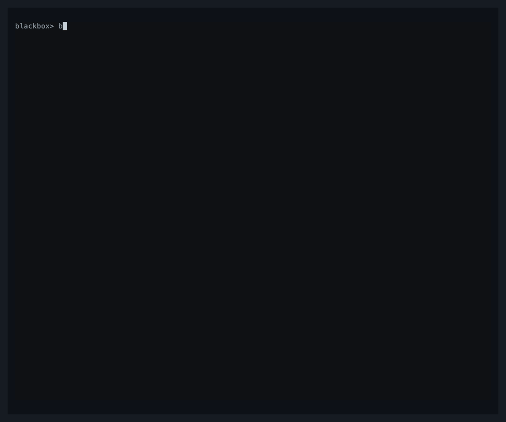

# Blackbox

[](https://github.com/ebubekiryigit/blackbox-ebpf/actions/workflows/ci.yml)
[](https://github.com/ebubekiryigit/blackbox-ebpf/releases)
[](LICENSE)

Blackbox is a bounded eBPF flight recorder for Linux incidents. It continuously
keeps recent kernel evidence in memory. When something goes wrong, you freeze the
preceding window into a `.bbx` capture and analyze it offline.

Blackbox is built for the evidence that is usually gone by the time an operator
starts investigating: I/O latency, scheduler delay, TCP retransmits and resets,
OOM victims, and gaps in the collection itself. It runs locally with no external
service, database, or listening TCP port.

> **v0.1.0 is a public preview.** Broad kernel validation and sustained production
> overhead measurements remain on the [roadmap](ROADMAP.md).



## Quick start

Recording requires a Linux kernel with BTF and permission to load BPF programs.
Docker Compose provides the complete recorder environment:

```sh
cp config.example.yml config.yml
mkdir -p captures
docker compose up -d --build

docker compose exec blackbox /app/blackbox status
docker compose exec blackbox /app/blackbox snapshot -o /captures/incident.bbx
docker compose exec blackbox /app/blackbox analyze /captures/incident.bbx
```

This starts the daemon with five minutes of bounded rolling history, shows sensor
health, writes `captures/incident.bbx` on the host, and prints a terminal report.
Capture destinations are private and never overwritten, so choose a new `-o` path
for the next incident.

The Compose service is privileged and observes the Linux host PID and network
namespaces. On Docker Desktop it records the Linux VM, not the macOS kernel. Review
the [host and mount requirements](docs/operations.md#host-requirements-and-docker-mounts)
before deploying it to a server.

## What Blackbox records

| Signal | Evidence |
| --- | --- |
| Block I/O | Device request latency histograms and retained slow-request details |
| Scheduler | Runnable-to-running latency and retained slow-task details |
| TCP | Retransmissions and sent/received reset observations with endpoints |
| OOM | Kernel-selected out-of-memory victims |

Normal activity stays in bounded kernel aggregates. Only selected details cross
to userspace. Kernel maps, rings, queues, retained history, capture decoding, and
report output all have explicit bounds.

Reports separate two questions:

- **What was observed?** Slow I/O, scheduler waits, TCP activity, and OOM victims.
- **How complete is the evidence?** Sensor availability, collection loss, rate
  limiting, decode failures, and missing history.

A green report applies only to the captured evidence. Blackbox classifies signals
without claiming a root cause.

## How it works

```text
eBPF sensors → bounded kernel aggregates and selected details
             → rolling in-memory history
             → snapshot.bbx
             → offline terminal or JSON analysis
```

The foreground daemon owns recording. `status` and `snapshot` use its private Unix
socket and do not reload configuration. Best-effort mode continues with available
sensors and records missing coverage. `--strict` stops if any enabled sensor cannot
initialize or fails permanently.

Snapshots are self-contained and can be moved to another machine for analysis.
Offline analysis needs neither root nor eBPF access and works on Linux or macOS.

## Install a release binary

[GitHub Releases](https://github.com/ebubekiryigit/blackbox-ebpf/releases/latest)
provides static Linux binaries for `amd64` and `arm64`. Each archive includes the
example config, systemd unit, project licenses, and runtime dependency notices.

```sh
version=v0.1.0
arch=amd64 # use arm64 on ARM hosts
archive="blackbox-${version}-linux-${arch}.tar.gz"

curl -fLO "https://github.com/ebubekiryigit/blackbox-ebpf/releases/download/${version}/${archive}"
curl -fLO "https://github.com/ebubekiryigit/blackbox-ebpf/releases/download/${version}/checksums.txt"
sha256sum --ignore-missing -c checksums.txt
tar -xzf "$archive"
cd "blackbox-${version}-linux-${arch}"
./blackbox version
```

Install it on the recording host:

```sh
sudo install -m 0755 blackbox /usr/local/bin/blackbox
sudo install -d -m 0755 /etc/blackbox
sudo install -m 0600 config.example.yml /etc/blackbox/config.yml
sudo blackbox config check --config /etc/blackbox/config.yml
sudo blackbox daemon --config /etc/blackbox/config.yml
```

The config copy is for a fresh installation. Preserve and validate an existing
`/etc/blackbox/config.yml` during upgrades. See the
[systemd instructions](docs/operations.md#systemd) for managed startup.

## CLI workflow

```sh
# Inspect the running recorder.
sudo blackbox status

# Save the daemon's configured history or a shorter window.
sudo blackbox snapshot -o incident.bbx
sudo blackbox snapshot --last 30s -o incident-30s.bbx

# Record a standalone window when no daemon is running.
sudo blackbox capture --duration 30s -o standalone.bbx

# Analyze without root privileges.
blackbox analyze incident.bbx
blackbox analyze incident.bbx --verbose
blackbox analyze incident.bbx --json > report.json
```

Successful `capture`, `snapshot`, and `demo` commands write only the absolute saved
path to stdout. Diagnostics use stderr, which keeps shell pipelines predictable.

## Configuration

The operator surface covers log level, retained history and memory, enabled
sensors, failure policy, polling/control timing, and block I/O and scheduler
latency thresholds. The commented [config.example.yml](config.example.yml) lists
every accepted value.

Configuration precedence is compiled defaults, explicit YAML, explicit CLI flags,
then validation. No file is discovered implicitly. Unknown or duplicate keys,
multiple YAML documents, malformed types, and unsafe values fail before recording.

```sh
blackbox config check --config config.yml
blackbox config show --config config.yml
blackbox config show --config config.yml --history 2m --strict
```

## Documentation

| Document | Contents |
| --- | --- |
| [Operations](docs/operations.md) | Host requirements, Docker/systemd deployment, resources, and report interpretation |
| [Configuration](docs/configuration.md) | YAML schema, precedence, validation, and resource semantics |
| [CLI reference](docs/cli.md) | Generated commands, flags, and defaults |
| [Architecture](docs/architecture.md) | Data flow, ownership boundaries, sensors, and persistence |
| [Compatibility](docs/compatibility.md) | Release, config, capture, socket, and upgrade policy |
| [Contributing](CONTRIBUTING.md) | Development workflow, tests, and change requirements |
| [Security](SECURITY.md) | Private vulnerability reporting and capture data boundaries |
| [Roadmap](ROADMAP.md) | Validation required before a stable release |

## Development

```sh
make build
make check
```

Ordinary builds use committed embedded eBPF bytecode. Sensor changes also require
`make generate` and privileged `make integration` on a BTF-enabled Linux kernel or
Docker VM. See the [development guide](docs/development.md).

To explore the analyzer without loading eBPF, create an explicitly synthetic
capture:

```sh
./bin/blackbox demo -o demo.bbx
./bin/blackbox analyze demo.bbx
```

## License

Go/userspace code and documentation are licensed under [Apache-2.0](LICENSE).
BPF sources are dual-licensed under `Apache-2.0 OR GPL-2.0-only`; loaded BPF ELF
programs declare `GPL` to the Linux kernel for GPL-only helpers. See the
[component license guide](LICENSES/README.md).

Reviewed dependency licenses and notices are tracked under
[third_party](third_party/README.md) and included in runtime images and binary
release archives.
